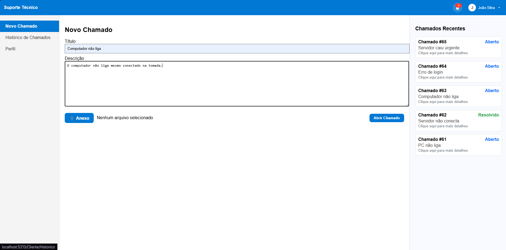

# Sistema Inteligente de Gestão de Chamados e Suporte Técnico

Sistema completo para **gestão de chamados de TI**, com **triagem automática baseada em Inteligência Artificial**, desenvolvido com foco em **eficiência operacional, segurança da informação e conformidade com a LGPD**.

---

## 🚀 Visão Geral

Esta aplicação foi desenvolvida para otimizar o atendimento de suporte técnico interno em empresas, automatizando processos críticos como **classificação de chamados**, **definição de prioridade** e **sugestão de soluções**.

O sistema é **multiplataforma**, contando com interface Web e backend centralizado, permitindo o acompanhamento completo do ciclo de vida do chamado.

---

## 🧩 Fluxo do Sistema

### 📝 Abertura de Chamado (Usuário)

O usuário pode abrir um novo chamado informando título, descrição e anexos.  
O sistema registra automaticamente data, usuário e status inicial.

---

### 🤖 Sugestão Automática com Inteligência Artificial

Após a abertura do chamado, a IA analisa o conteúdo textual e sugere possíveis soluções com base em histórico e base de conhecimento.

O usuário pode informar se a sugestão resolveu o problema, contribuindo para o aprendizado do sistema.

---

### 💬 Interação entre Técnico e Usuário

Os técnicos recebem os chamados conforme prioridade e podem interagir diretamente com o usuário por meio de um chat integrado, além de alterar o status do chamado.

---

### 🛠️ Painel Administrativo

O administrador possui controle total do sistema, incluindo:
- Gerenciamento de usuários
- Controle de perfis e permissões
- Relatórios por período, técnico, categoria e prioridade
- Visualização gráfica de indicadores

---

## 🎯 Funcionalidades Principais

### Usuário
- Abertura e acompanhamento de chamados
- Recebimento de sugestões automáticas da IA
- Avaliação da solução proposta
- Envio de anexos
- Comunicação com o suporte

### Técnico
- Visualização de chamados atribuídos
- Atualização de status
- Comunicação direta com usuários
- Controle de prioridade e SLA

### Administrador
- Gerenciamento de usuários e perfis
- Geração de relatórios
- Dashboards de desempenho
- Auditoria e controle do sistema

---

## 🛠️ Tecnologias Utilizadas

- **C# / ASP.NET**
- **SQL Server**
- **Arquitetura MVC**
- **APIs REST**
- **Integração com IA**
- **Autenticação com JWT**
- **Geração de relatórios**
- **Git para versionamento**

---

## 🔐 Segurança e LGPD

O sistema segue boas práticas de segurança e os princípios da **Lei Geral de Proteção de Dados (LGPD)**:
- Controle de acesso por perfil
- Senhas criptografadas
- Logs de auditoria
- Tratamento responsável de dados pessoais

---

## 👤 Autor

**Vinicius Ferreira Colombo**  
Estudante de Análise e Desenvolvimento de Sistemas  
Foco em Backend e Full Stack  

---

## 📄 Licença

Projeto desenvolvido para fins de **portfólio e aprendizado**.
